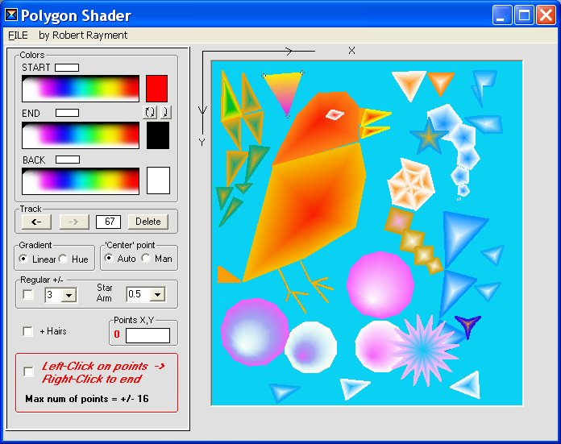



## PolyShader\( \+ Stars\)

### Description

PolyShader by Robert Rayment. (+ Stars) Demonstrates shading of regular and user defined polygons. Zip 36 KB.
 
### More Info
 
Jusr run

             |
---                |---
**Submitted On**   |2004-12-05 09:15:30
**By**             |[Robert Rayment](https://github.com/Planet-Source-Code/PSCIndex/blob/master/ByAuthor/robert-rayment.md)
**Level**          |Beginner
**User Rating**    |4.8 (63 globes from 13 users)
**Compatibility**  |VB 6\.0
**Category**       |[Graphics](https://github.com/Planet-Source-Code/PSCIndex/blob/master/ByCategory/graphics__1-46.md)
**World**          |[Visual Basic](https://github.com/Planet-Source-Code/PSCIndex/blob/master/ByWorld/visual-basic.md)
**Archive File**   |[PolyShader1825661252004\.zip](https://github.com/Planet-Source-Code/robert-rayment-polyshader-stars__1-57507/archive/master.zip)

### API Declarations

Dialog APIs

